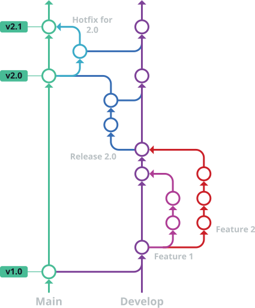

# Contributing to HiveDrop

Thank you for contributing! This project follows Git Flow for branch management and releases.

## 🌊 Git Flow Strategy



### Branch Structure

- **`main`** - Production releases, always deployable
- **`develop`** - Integration branch for ongoing development
- **`feature/*`** - New features and enhancements
- **`release/*`** - Release preparation and bug fixes
- **`hotfix/*`** - Critical production fixes

### Workflow

#### New Features

1. Create feature branch from `develop`:
   ```bash
   git checkout develop
   git pull origin develop
   git checkout -b feature/add-new-packages
   ```

2. Develop and commit changes
3. Push and create PR to `develop`
4. After review/approval, merge to `develop`

#### Releases

1. Create release branch from `develop`:
   ```bash
   git checkout -b release/1.2.0
   ```

2. Version bumping, documentation updates, minor fixes only
3. Create PR to `main`
4. After merge, tag release:
   ```bash
   git tag 1.2.0
   git push origin 1.2.0
   ```

5. Merge `main` back to `develop`

#### Hotfixes

1. Create hotfix branch from `main`:
   ```bash
   git checkout -b hotfix/fix-nginx-config
   ```

2. Fix and create PR to `main`
3. After merge, cherry-pick to `develop`

## 📝 Contributing Guidelines

### Adding Software Packages

**VS Code Extensions:**
- Add extension ID to `pollen/vscode-extensions.txt`
- One ID per line: `publisher.extension-name`

**Winget Packages:**
- Add package ID to `pollen/winget-packages.txt`
- Verify ID exists: `winget show <package-id>`

### Code Standards

- **PowerShell**: Follow [PowerShell Style Guide](https://github.com/PoshCode/PowerShellPracticeAndStyle)
- **Docker**: Multi-stage builds, non-root user
- **Commit Messages**: Use [Conventional Commits](https://conventionalcommits.org/)

### Testing

Test Docker builds locally:
```bash
docker build -t hivedrop:test .
docker run --rm -p 8080:8080 hivedrop:test
```

### Pull Request Process

1. **Branch naming**:
   - `feature/description-of-feature`
   - `hotfix/fix-description`
   - `release/1.2.0`

2. **PR Requirements**:
   - Clear description of changes
   - Link to related issues
   - Test results (if applicable)

3. **Review Process**:
   - At least one reviewer approval
   - All CI checks passing
   - No merge conflicts

## 🚀 Release Process

1. **Weekly Releases**: Automated builds every Sunday 22:00 UTC
2. **Manual Releases**: Tag-triggered builds from `main`
3. **Versioning**: [Semantic Versioning](https://semver.org/)

## 🐛 Reporting Issues

Use GitHub Issues with:
- Clear problem description
- Steps to reproduce
- Expected vs actual behavior
- Environment details (Docker version, OS)

## 💡 Feature Requests

- Check existing issues first
- Provide use case and rationale
- Consider implementation complexity